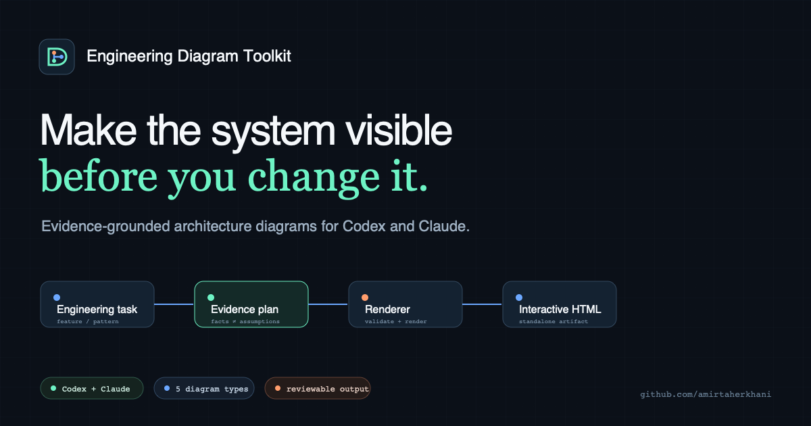

<p align="center">
  
</p>

<h1 align="center">Engineering Diagram Toolkit</h1>

<p align="center">
  AI-powered software engineering diagrams for Codex and Claude—grounded in code, explicit about uncertainty, and rendered as interactive standalone HTML.
</p>

<p align="center">
  <a href="https://github.com/amirtaherkhani/engineering-diagram-toolkit/actions/workflows/ci.yml"></a>
  <a href="https://github.com/amirtaherkhani/engineering-diagram-toolkit/actions/workflows/pages.yml"></a>
  <a href="https://github.com/amirtaherkhani/engineering-diagram-toolkit/releases"></a>
  <a href="./LICENSE"></a>
  
</p>

<p align="center">
  <a href="https://amirtaherkhani.github.io/engineering-diagram-toolkit/"><strong>Explore the live site</strong></a>
  ·
  <a href="#install">Install</a>
  ·
  <a href="#how-it-works">How it works</a>
</p>



Engineering Diagram Toolkit turns a task, feature, code path, design pattern, incident, or best-practice discussion into the smallest useful software engineering diagram. It combines an evidence-aware agent workflow, five native MCP tools, a deterministic CLI, and an interactive renderer in one repository that works with both OpenAI Codex and Claude Code.

## Why this exists

Most generated architecture diagrams fail in one of two ways: they are attractive but unverified, or accurate but too dense to support a decision. This toolkit treats a diagram as an engineering artifact:

- Important nodes and edges trace back to code, contracts, runtime evidence, or an explicit requirement.
- Verified facts, assumptions, and recommendations stay visibly distinct.
- Each view answers one question instead of attempting to show the entire system.
- JSON source is validated before standalone HTML is delivered.
- Mobile layout, keyboard focus, contrast, and reduced motion are quality gates.

## What it can visualize

| View | Best question | Typical use |
| --- | --- | --- |
| Architecture | What exists and who depends on it? | feature boundaries, services, modules, deployment topology, design patterns |
| Sequence | What happens over time? | API requests, webhooks, retries, provider integrations |
| Workflow | Which steps and decisions control the outcome? | implementation plans, approvals, incident response, best practices |
| Dataflow | Where does data originate, transform, and land? | events, queues, analytics, storage, data ownership |
| Lifecycle | How does an entity change state? | jobs, deployments, orders, sessions, incident states |

## Install

### Codex

Add the GitHub repository as a Codex marketplace, then install the plugin:

```bash
codex plugin marketplace add amirtaherkhani/engineering-diagram-toolkit
codex plugin add engineering-diagram-toolkit@engineering-diagram-toolkit
```

Start a new thread and try:

```text
Use $engineering-diagram to visualize this feature from API entry point to persistence.
```

### Claude Code

Run these commands inside Claude Code:

```text
/plugin marketplace add amirtaherkhani/engineering-diagram-toolkit
/plugin install engineering-diagram-toolkit@engineering-diagram-toolkit
/reload-plugins
```

Then invoke the namespaced skill:

```text
/engineering-diagram-toolkit:engineering-diagram
```

Both plugin installs start the bundled `engineering-diagrams` stdio server automatically. No separate MCP registration or API key is required.

### CLI

The CLI has no runtime npm dependencies:

```bash
git clone https://github.com/amirtaherkhani/engineering-diagram-toolkit.git
cd engineering-diagram-toolkit
node bin/diagram-toolkit.mjs doctor
```

Choose a diagram, create a plan, review it, then render:

```bash
node bin/diagram-toolkit.mjs advise "trace an idempotent checkout API request" --json
node bin/diagram-toolkit.mjs plan "trace an idempotent checkout API request" --out checkout.plan.json
node bin/diagram-toolkit.mjs review examples/checkout-feature.diagram-plan.json
node bin/diagram-toolkit.mjs validate architecture examples/plugin-request.architecture.json --quality showcase
node bin/diagram-toolkit.mjs render architecture examples/plugin-request.architecture.json diagram.html --quality showcase
```

## Native MCP tools

Codex and Claude can call the same deterministic core directly:

| Tool | Purpose | State |
| --- | --- | --- |
| `advise_diagram` | Choose the smallest useful view for a task | read-only |
| `create_diagram_plan` | Establish scope, evidence lanes, and the primary question | read-only |
| `review_diagram_plan` | Find unsupported facts and missing decision context | read-only |
| `validate_diagram` | Run schema, renderer, accessibility, and composition checks | read-only |
| `render_diagram` | Deliver validated standalone HTML to an absolute path | local write |

The server implements MCP over stdio without runtime npm dependencies. Its portable launcher resolves from Claude's plugin-root environment or Codex's plugin working directory, and each structured result also includes a text representation for compatibility.

## Included skills

### `engineering-diagram`

Inspects source evidence, selects the right view, separates facts from assumptions and recommendations, authors JSON IR, validates the result, and delivers a reviewable standalone diagram.

Example prompts:

- “Map this feature from controller to database and show the trust boundaries.”
- “Explain the Strategy pattern for this task, including why it fits and where it does not.”
- “Visualize the async job lifecycle, retry policy, and terminal failure states.”
- “Find the clearest best-practice workflow for rolling out this schema change.”

### `review-diagram`

Audits an existing diagram for unsupported claims, missing boundaries, ambiguous edges, visual defects, accessibility, and decision usefulness.

Example prompts:

- “Review this diagram against the repository and list unsupported architecture claims.”
- “Check whether current behavior and the proposed design are visually distinct.”
- “Validate this JSON and inspect the HTML at mobile and desktop widths.”

## How it works

```text
task or feature
      │
      ▼
source evidence ──► diagram plan ──► diagram JSON IR ──► validated HTML
      ▲                   │                                  │
      └──────────── review findings ◄────────────────────────┘
```

The canonical plan keeps three claim lanes:

```json
{
  "evidence": {
    "facts": [{ "statement": "The API requires an idempotency key.", "source": "openapi.json" }],
    "assumptions": [{ "statement": "Reservations expire.", "source": "product confirmation needed" }],
    "recommendations": [{ "statement": "Persist replay results.", "source": "toolkit guidance" }]
  }
}
```

See [`schemas/diagram-plan.schema.json`](./schemas/diagram-plan.schema.json), the [checkout plan](./examples/checkout-feature.diagram-plan.json), and the [architecture example](./examples/plugin-request.architecture.json).

## Dependency updates

The scheduled dependency workflow checks pinned sources every week. Each update is isolated in a reviewable pull request with checks for:

- license and security changes;
- schema and rendering compatibility;
- evidence semantics and visual quality;
- the complete `npm run check` suite.

Run the read-only check locally:

```bash
npm run upstreams:check
```

Dependency updates never silently rewrite the canonical skills.

## Repository structure

```text
.codex-plugin/              Codex plugin manifest
.claude-plugin/             Claude plugin + marketplace
.agents/plugins/            Codex repository marketplace
skills/
  engineering-diagram/      creation workflow and evidence contract
  review-diagram/           correctness and visual review workflow
bin/                        zero-dependency CLI
mcp/                        native stdio MCP tools for Codex and Claude
knowledge/                  diagram selection recipes
schemas/                    plan and advice contracts
examples/                   validated plans and renderer JSON
vendor/                     pinned runtime and methodology snapshots
docs/                       GitHub Pages site
scripts/                    validation and dependency automation
test/                       Node test suite and renderer smoke tests
```

## Development

```bash
npm install --ignore-scripts
npm run check
```

The test suite covers MCP initialization and tools, recommendation selection, evidence review, plugin health, plan creation, renderer showcase validation, overwrite protection, and standalone HTML rendering.

## Contributing

Diagram recipes, accessibility improvements, examples, renderer adapters, and agent compatibility fixes are welcome. Read [CONTRIBUTING.md](./CONTRIBUTING.md) before opening a pull request.

## License

Engineering Diagram Toolkit is available under the [MIT License](./LICENSE). Required third-party copyright and license notices are preserved in [third-party notices](./THIRD_PARTY_NOTICES.md).
