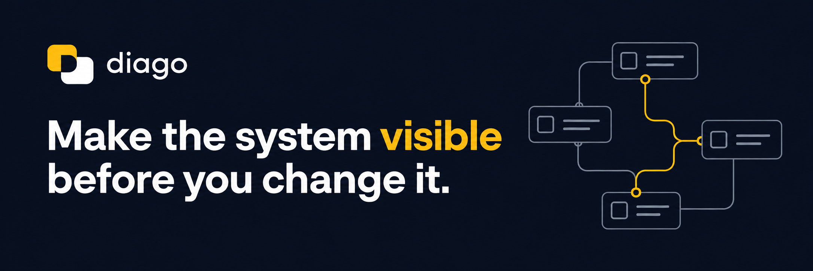

<a name="top"></a>

<p align="center">
  <a href="https://amirtaherkhani.github.io/diago/">
    
  </a>
</p>

<h1 align="center">A little clarity for your next big change. ✨</h1>

<p align="center">
  <strong>Your code has a story. Diago helps you draw it.</strong><br>
  Evidence-grounded, interactive engineering diagrams for <strong>Codex</strong> and <strong>Claude Code</strong>.
</p>

<p align="center">
  <a href="https://amirtaherkhani.github.io/diago/"></a>
  <a href="#install"></a>
</p>

<p align="center">
  <a href="https://github.com/amirtaherkhani/diago/actions/workflows/ci.yml"></a>
  <a href="https://github.com/amirtaherkhani/diago/releases"></a>
  <a href="./LICENSE"></a>
  <a href="./package.json"></a>
</p>

<p align="center">
  <a href="#what-you-can-build">🧩 Diagram gallery</a> &nbsp;·&nbsp;
  <a href="#use-after-installation">🪄 Prompt recipes</a> &nbsp;·&nbsp;
  <a href="#contributing">🌱 Contribute</a> &nbsp;·&nbsp;
  <a href="./docs/USAGE.md">📖 Docs</a>
</p>

<p align="center"><sub>8 diagram views &nbsp; / &nbsp; 4 agent skills &nbsp; / &nbsp; Standalone HTML &nbsp; / &nbsp; Zero runtime npm dependencies</sub></p>

---

## ✨ Turn “how does this work?” into “now I see it.”

**Diago is an open-source MCP toolkit for software architecture diagrams in Codex and Claude Code.** It combines agent skills, a local Model Context Protocol server, and deterministic renderers to turn repository evidence into interactive HTML diagrams.

Point Diago at a repository, a feature, or an architecture conversation. Keep the diagram JSON and standalone HTML together so you can review, share, and regenerate the result.

[Getting started guide](https://amirtaherkhani.github.io/diago/guide/) · [Frequently asked questions](https://amirtaherkhani.github.io/diago/#faq)

| 🔎 Follow the evidence | 🧩 Find the right view | 🎁 Keep the artifact |
| :--- | :--- | :--- |
| Trace claims to code and contracts. Keep assumptions visible. | Pick the diagram that answers your question. Split crowded systems into smaller views. | Get validated JSON and interactive HTML with responsive layouts and keyboard controls. |

> [!TIP]
> **Just looking around?** [Try the live demo](https://amirtaherkhani.github.io/diago/#top) before installing. Switch between all eight views and pause on the one you want to explore.

<a name="install"></a>

## ⚡ Your first diagram starts here

You need **Node.js 18+**. Pick your favorite agent, install Diago, and open a new thread in the project you want to understand.

<details open>
<summary><strong>① Codex — install, then ask</strong></summary>

```bash
codex plugin marketplace add amirtaherkhani/diago
codex plugin add diago@diago
```

Your first prompt:

```text
Use $diago-engineering-diagram to map this feature from its API entry point
through the service layer to persistence. Inspect the code, label assumptions,
and render an architecture view and a sequence view.
```

</details>

<details>
<summary><strong>② Claude Code — install, then ask</strong></summary>

Run inside Claude Code:

```text
/plugin marketplace add amirtaherkhani/diago
/plugin install diago@diago
/reload-plugins
```

Then start with:

```text
/diago:diago-engineering-diagram
Map this feature from its API entry point to persistence. Inspect the code,
label assumptions, and render architecture and sequence views.
```

</details>

<details>
<summary><strong>③ CLI — render a ready-made example</strong></summary>

```bash
git clone https://github.com/amirtaherkhani/diago.git
cd diago
node bin/diago.mjs doctor
node bin/diago.mjs render architecture examples/plugin-request.architecture.json diagram.html --quality showcase
```

Open `diagram.html` in your browser. The CLI validates and renders existing JSON; your agent authors the diagram source from your evidence.

```bash
node bin/diago.mjs types --json
node bin/diago.mjs advise "trace an idempotent checkout API request"
node bin/diago.mjs plan "trace an idempotent checkout API request" --out checkout.plan.json
node bin/diago.mjs review examples/checkout-feature.diagram-plan.json
```

Want to connect the MCP server directly? [Use the setup guide →](./docs/USAGE.md#connect-the-mcp-server-directly-to-codex)

</details>

Both plugins start the bundled `engineering-diagrams` MCP server automatically. Diago needs no separate API key or hosted service; your agent's own access requirements still apply.

<a name="what-you-can-build"></a>

## 🧩 One question. The right diagram.

| You want to understand… | Reach for… | Open an example |
| :--- | :--- | :--- |
| **The big picture** — components, ownership, dependencies | Architecture | [Plugin request JSON](./examples/plugin-request.architecture.json) |
| **The conversation** — calls, responses, ordering | Sequence | [Live demo](https://amirtaherkhani.github.io/diago/#top) → Sequence |
| **The next step** — decisions, branches, approvals | Workflow | [Live demo](https://amirtaherkhani.github.io/diago/#top) → Workflow |
| **The journey** — data sources, transformations, destinations | Dataflow | [Live demo](https://amirtaherkhani.github.io/diago/#top) → Dataflow |
| **The state changes** — triggers, retries, terminal outcomes | Lifecycle | [Live demo](https://amirtaherkhani.github.io/diago/#top) → Lifecycle |
| **The domain** — entities, keys, relationships | Data model | [Order domain JSON](./examples/order-domain.data-model.json) |
| **The milestones** — phases, dependencies, timing | Timeline | [Migration JSON](./examples/payment-migration.timeline.json) |
| **The boundaries** — responsibilities and controls | Layers | [Checkout controls JSON](./examples/checkout-controls.layers.json) |

<sub>The live-demo links open the same workbench. Choose the named tab to see that view.</sub>

<a name="use-after-installation"></a>

## 🪄 A few prompts to borrow

<details open>
<summary><strong>🔍 “Help me understand this feature.”</strong></summary>

```text
Use $diago-engineering-diagram to trace checkout from API entry to payment
and persistence. Show ownership, trust boundaries, and failure paths.
```

</details>

<details>
<summary><strong>💬 “Turn our conversation into architecture.”</strong></summary>

```text
Use $diago-chat-architecture to visualize the architecture in this conversation.
Show components, responsibilities, and directed relationships. Separate
accepted decisions from proposals, assumptions, and unresolved questions.
```

</details>

<details>
<summary><strong>🧐 “Give this diagram a second pair of eyes.”</strong></summary>

```text
Use $diago-review-diagram to audit this diagram against the repository.
List unsupported claims, missing boundaries, and ambiguous relationships.
```

</details>

In Claude Code, use `/diago:diago-engineering-diagram` instead of `$diago-engineering-diagram`, and the same namespace for the other skills. [More recipes →](./docs/USAGE.md#example-prompts)

> [!TIP]
> **The tiny recipe for a useful prompt:** name the **decision**, point to the **evidence**, and name the **reader**. Then ask Diago to separate current behavior from proposed changes.
>
> *Example: “Explain retry ownership in checkout for a backend reviewer. Start at `src/checkout` and mark anything you cannot verify.”*

<a name="how-it-works"></a>

## 🛠 A peek under the hood

```text
Your question + source evidence
               ↓
         Diagram plan       scope · audience · facts · assumptions
               ↓
         Diagram JSON       focused view · bounded detail
               ↓
      Validate → Render     interactive standalone HTML
               ↓
         Review & refine
```

The agent inspects sources and authors the diagram. Diago's deterministic core reviews, validates, and renders it. Each view records what was merged, collapsed, or omitted. Keep the JSON and HTML together so the diagram stays reviewable.

> [!NOTE]
> **Diago v0.7.0 includes all seven MCP tools**, including `plan_evidence_workflow`. Update an older plugin installation to use evidence planning. [Release notes →](./docs/releases/v0.7.0.md)

<details>
<summary><strong>🔌 Explore the MCP toolbox and agent skills</strong></summary>

### Native MCP tools

| Tool | Purpose |
| :--- | :--- |
| `list_diagram_types` | Discover renderers, profiles, patterns, and budgets |
| `advise_diagram` | Select a useful view for a task |
| `create_diagram_plan` | Establish scope, evidence, and the reader's question |
| `plan_evidence_workflow` | Identify ready evidence work and surface failures, retry limits, and claim conflicts |
| `review_diagram_plan` | Find unsupported claims and missing context |
| `validate_diagram` | Check schema, renderer, accessibility, and composition rules |
| `render_diagram` | Write validated standalone HTML to an absolute local path |

Only `render_diagram` writes an artifact. The server uses local stdio transport.

### Included skills

| Skill | Use it to |
| :--- | :--- |
| `diago-engineering-diagram` | Inspect evidence, choose a view, author JSON, and render |
| `diago-chat-architecture` | Extract connected architecture from a conversation |
| `diago-review-diagram` | Audit evidence, boundaries, clarity, and visual quality |
| `diago-update-upstreams` | Check every pinned source and integrate reviewed updates |

</details>

<a name="evidence-workflows"></a>

<details>
<summary><strong>🧪 Evidence workflows · new in v0.7.0</strong></summary>

### How evidence planning works

**Available in Diago v0.7.0.** Use the MCP tool from the updated plugin, or run the CLI example below from a v0.7.0 source checkout. See the [release notes](./docs/releases/v0.7.0.md).

Use `diago evidence` or the read-only `plan_evidence_workflow` MCP tool when a diagram needs evidence from independent sources and dependent cross-checks:

```bash
node bin/diago.mjs evidence examples/checkout.evidence-workflow.json --json
```

The planner returns up to the configured number of ready tasks. The host inspects sources, records attempts and verification verdicts in the JSON snapshot, then evaluates it again. Failed branches retain their errors while independent work continues; only explicit retryable failures and timeouts get another attempt. Conflicting claims stay out of the plan's facts.

See [the workflow guide](./docs/evidence-workflows.md) for the snapshot contract, concurrency and timeout handling, evidence reconciliation, and a complete example. Source inspection and verification are performed by the host: Diago neither launches workers nor independently proves the reported claims.

</details>

<a name="contributing"></a>

## 🌱 Small contributions are very welcome

A clearer sentence, a useful prompt, or one well-explained diagram can make someone's first experience better.

| Your kind of contribution | A lovely place to start |
| :--- | :--- |
| 📝 **Words** | Improve a setup step or explain a confusing concept |
| 🧩 **Examples** | Add diagram JSON with its question and evidence references |
| 🎨 **Polish** | Improve layout, keyboard navigation, or small-screen readability |
| 🔧 **Code** | Fix a reproducible issue or improve agent compatibility |

<details>
<summary><strong>My first pull request — a small checklist</strong></summary>

- [ ] Read the [contribution guide](./CONTRIBUTING.md) and pick one focused change.
- [ ] [Fork Diago](https://github.com/amirtaherkhani/diago/fork) and create a branch.
- [ ] Explain the engineering question or problem your change solves.
- [ ] Run `npm run check`; include screenshots for visual changes.
- [ ] Remove secrets and private details from examples.
- [ ] Open a pull request with the result and verification notes.

```bash
git clone https://github.com/YOUR-USERNAME/diago.git
cd diago
git switch -c docs/add-diagram-example
npm install --ignore-scripts
npm run check
```

</details>

[Browse issues](https://github.com/amirtaherkhani/diago/issues) · [Suggest a use case](https://github.com/amirtaherkhani/diago/issues/new?template=feature_request.yml) · [Report a bug](https://github.com/amirtaherkhani/diago/issues/new?template=bug_report.yml)

<a name="help-diago-grow"></a>

## 💛 Help this little project grow

**If Diago gave you an “aha!” moment, pass it on.**

- **Leave a star** to show the project was useful to you.
- **Fork and make it yours** — try a new recipe, example, or integration, then share the improvement back.
- **Show what you built** — share a diagram with the question it answered, the prompt, and a link to Diago.
- **Tell us what got in the way** — a clear issue can make the next person's setup easier.

<details>
<summary><strong>💌 A short introduction you can share</strong></summary>

```text
Meet Diago: engineering diagrams for Codex and Claude Code.
Turn a feature, code path, or architecture conversation into an interactive
HTML diagram, with evidence and assumptions kept visible.

Try the eight-view demo: https://amirtaherkhani.github.io/diago/
Source and setup: https://github.com/amirtaherkhani/diago
```

Add your own screenshot, prompt, and what you learned. Share it where it answers a relevant engineering question.

</details>

<p align="center">
  <a href="https://github.com/amirtaherkhani/diago/stargazers"></a>
  <a href="https://github.com/amirtaherkhani/diago/fork"></a>
</p>

<p align="center"><strong><a href="https://github.com/amirtaherkhani/diago">☆ Star Diago</a> &nbsp; · &nbsp; <a href="https://github.com/amirtaherkhani/diago/fork">⑂ Make a fork</a></strong></p>

<a name="development--reference"></a>

## 📚 The reading corner

| Resource | Find your next step |
| :--- | :--- |
| [Usage guide](./docs/USAGE.md) | Direct MCP setup, more prompts, and plan contracts |
| [Evidence workflows](./docs/evidence-workflows.md) | Dependency-aware planning and claim reconciliation |
| [Contributing](./CONTRIBUTING.md) | Development and diagram quality rules |
| [Design system](./DESIGN.md) | Logo, colors, layout, and accessibility |
| [Maintainer growth checklist](./docs/COMMUNITY.md) | Practical ideas for discoverability, demos, and first contributions |
| [Changelog](./CHANGELOG.md) · [Releases](https://github.com/amirtaherkhani/diago/releases) | What's changed and what's shipped |

<details>
<summary><strong>🗂 Repository map & local development</strong></summary>

```text
skills/       Agent creation, conversation, review, and upstream workflows
bin/          Zero-dependency CLI
mcp/          Native stdio MCP server and tool contracts
lib/          Planning, review, selection, and renderer integration
schemas/      Plan and diagram contracts
examples/     Validated plans and renderer JSON
vendor/       Pinned runtime and methodology snapshots
docs/         GitHub Pages, usage guide, and public brand assets
assets/       Plugin icon and logo
scripts/      Repository validation and upstream automation
test/         Node test suite and renderer checks
```

Run `npm run check` for repository validation and tests. Run `npm run upstreams:check` for read-only source discovery. The five tracked upstreams include [Oh My Mermaid](./docs/upstreams/oh-my-mermaid-review.md) as a methodology reference for perspective-based recursive analysis. Upstream changes are reviewed before the canonical skills are updated; [details](./docs/USAGE.md#dependency-updates).

</details>

## License

[MIT](./LICENSE), with required [third-party notices](./THIRD_PARTY_NOTICES.md) preserved.

---

<p align="center">
  <br>
  <sub>Small diagrams. Clearer decisions. Made for curious engineers.</sub><br><br>
  <a href="#top">↑ Back to the top</a>
</p>
